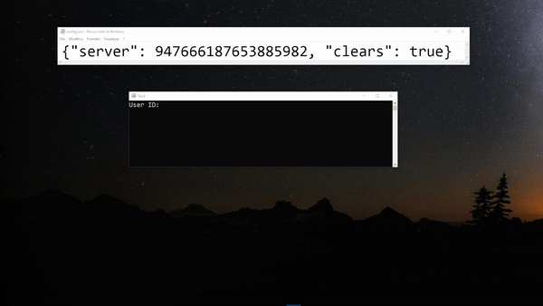
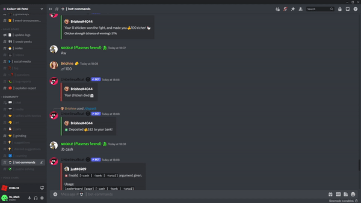

# Unbelievaboat Stats Grabber

Lets you track your progress while you are playing the game
‼ This does not give any advantages while playing the game.

## User Track

Tracks the stats of a user | You can get the discord id [Here](https://github.com/MarkinoTeck/unbelievaboat_stats_grabber/blob/main/README.md#how-to-get-discord-id)



## When to Work Progress Bar

Tells you when you need to work


## Leaderboard Track

Tracks the Leaderboard of a server


## Installation

Use the package manager [pip](https://pip.pypa.io/en/stable/) to install libraries.

```cmd
pip install datetime
pip install requests
pip install rich
```
## How to get discord id


Download the main.py file and run it no a folder, it will generate a file colled confing.json. 
In the generated file you can set the discord id to config the script.
Then run the main.py file again and all will work fine.
